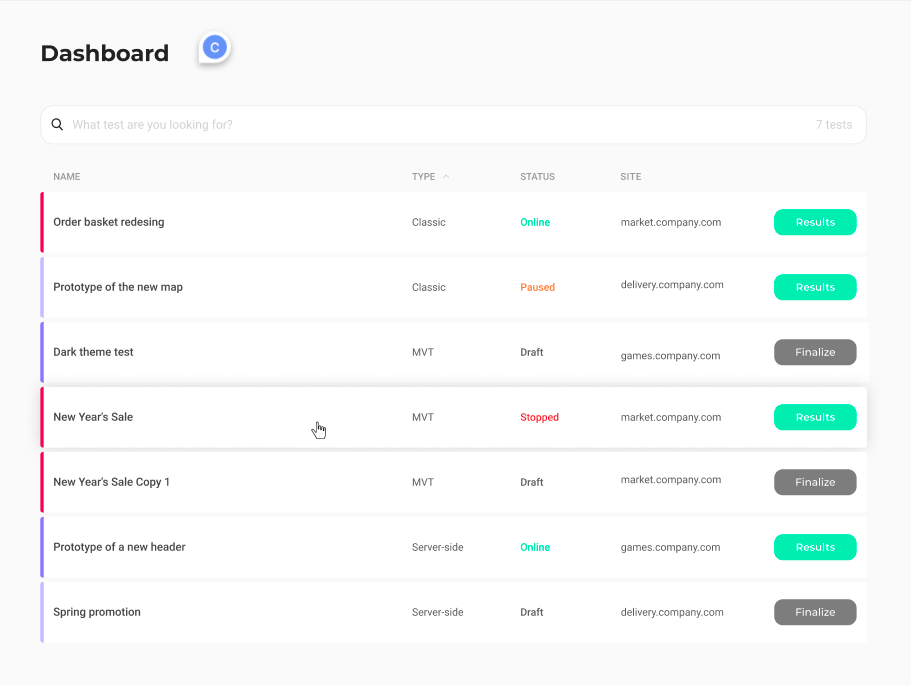
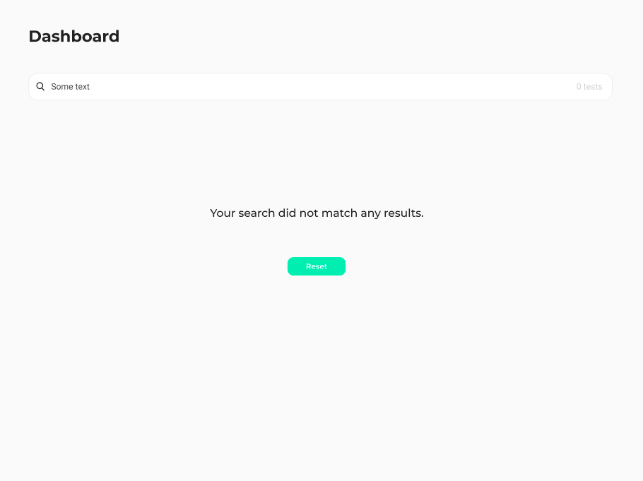

# The app is a dashboard page which used to display a list of created A/B tests

## Getting Started

### `git clone https://github.com/DmitryRag/kameleoon-test.git`
### `npm install`
### `npm start`

- The table is filled with the data that is requested from the JSON file using the API in this repository. You need to clone the project to your local machine and run it.
- When a user hovers over a table row it should be highlighted as shown in the mockup.
- Sites in the corresponding column must be displayed without the http or https protocols and www prefix.
- A user should be able to filter by item name. If the item exists we hide other
records and show only items that were found in the list. If no records are found there should
be a message with the corresponding text and a reset button.
- A user should be able to sort ASC, DESC by clicking on the titles of the columns:
    - name, type and site should be sorted in alphabetical order
    - status should be sorted in:
        - ASC: Online, Paused, Stopped, Draft
        - DESC: Draft, Stopped, Paused, Online
- Using the react-router-dom library, implement routing between three pages: dashboard, results, and finalize. And don't forget to load the necessary data for each page.
- When a user clicks on the Results or Finalize button on dashboard page, you should redirect to URLs /results/testId and /finalize/testId accordingly, without reloading the browser window.

